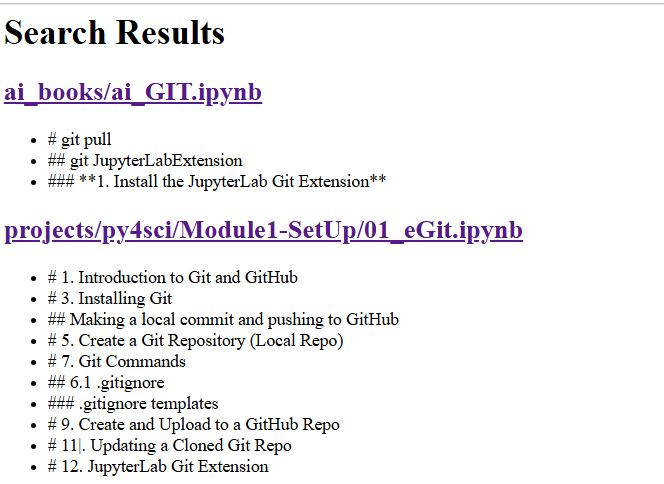

# Search Utility
This program will recursively search the **headings** of your markdown cells for all notebooks containing a search term, and then generate an html file with links to those notebooks.  The file will be called search_YOURSEARCHEDTERM.html.  When you click it a html page will open in your notebook.  This is using the sharable link, and so to open a notebook you need to right click and either open in new window, or open in new tab.  It will not work within the notebook you are running it in.  My advice is run this utility in its own browser, and the open the links in a new tab, so you can methodically go through them.
## Features
  1. The default diretory is your user-home directory (just hit enter), but you can specify a different directory
  2. case sensitive toggle
  3. enter search term
  4. other search?
  5. An html file called searh_searchterm.html will be made and placed in the folder search_results.  This folder will be created in your user-home directory if it does not exist.
  6. If you are researching a file, a number will be added or incremented by one at the end of the file name.

**Suggestion** Move the search utility into the search_results folder, and always run it from there, in a different jupyter lab browser window than the programs you are working on.  Before running a search check that you do not already have a file with that term.  You should rerun it if you have added documents since the last search that had that term in the headings

**Suggestion** Think as you make your notebooks and design your headings so they can be used to find material.  These search pages become a sort of dynamic linked index of all your work in all of your jupyter notebooks.  Also, this works at any level of heading

